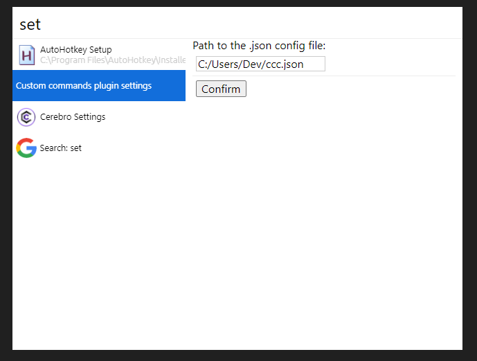

# cerebro-custom-command
A simple plugin to create custom commands to Cerebro only editing a JSON file

## Usage

* Type settings on cerebro and set a path for a .json file for the commands



* If the path isn't expecified, the plugin will look for the .json in this path: %appdata%/cerebro-custom-command/config.json
* In this file add your commands, example of the syntax for a command to open a playlist

```
{    
    "commands": [
        {
            "name": "Lo-Fi Playlist",
            "icon": "C:/path-to-icon/youtube-icon.png",
            "exec": "start chrome https://www.youtube.com/watch?v=Rhomn5Um9dg&list=RDRhomn5Um9dg&start_radio=1&t=0"
        }
    ]

}
```

You can also add custom keywords to your command using an array format:

```
{
    "commands": [
        {
            "name": "Lo-Fi Playlist",
            "icon": "C:/path-to-icon/youtube-icon.png",
            "exec": "start chrome https://www.youtube.com/watch?v=Rhomn5Um9dg&list=RDRhomn5Um9dg&start_radio=1&t=0",
            "keywords": ["lofi", "playlist"]
        }
    ]    
}
```

The plugin will match the command name or the keywords(if is specified)


You can also use more than one exec script for a command using the options array:

```
{
    "name": "Command",
    "icon": "C:/path-to-icon/icon.png",
    "exec": "explorer /e, C:\\path-to-folder",
    "options": [
        {
            "name": "Open with code",
            "exec": "code C:\\path-to-folder"
        },
        {
            "name": "Open with atom",
            "exec": "atom C:\\path-to-folder"
        }
    ]
}
```

## Here is some examples of commands

> The exec script in this examples are for Windows, but can be used the equivalent command in any system

* Open a folder (favorite folder, project)
```
{
    "name": "Documents",
    "icon": "C:/path-to-icon/folder-icon.png",
    "exec": "explorer /e, C:\\Users\\Name\\Documents"
}
```


* Open the GMail
```
{
    "name": "GMail",
    "icon": "C:/path-to-icon/gmail-icon.png",
    "exec": "start chrome https://mail.google.com/"
}
```


* Open a project folder with code

```
{
    "name": "Project A",
    "icon": "C:/path-to-icon/icon.png",
    "exec": "code C:\\path-to-project\\ProjectA"
}
```

* Open the .json config file

```
{
    "name": "config.json",
    "icon": "C:/path-to-icon/json.png",
    "exec": "code C:\\path-to-json\\config.json"
}
```


## Possible troubleshooting

If you are on Windows and want a command that open the explorer in some folder using the ```explorer /e, C:\path```, you will have to use double bars to specify the path, for example: ```C:\\Users\\YourName\\Documents```.
Here is how it will be the full command in the config.json:
```
{
    "name": "Command",
    "icon": "C:/path-to-icon/icon.png",
    "exec": "explorer /e, C:\\Users\\Name\\Documents"
}
```


## Related

* [Cerebro](http://github.com/KELiON/cerebro) – main repo for Cerebro app;
* [AHK Scripts Manager](https://github.com/filipestudt/cerebro-ahk-manager) - my other plugin;