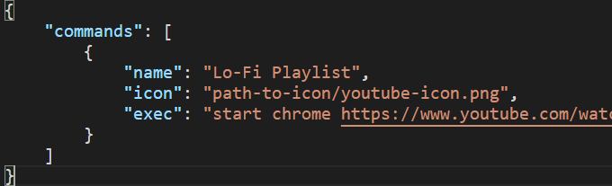
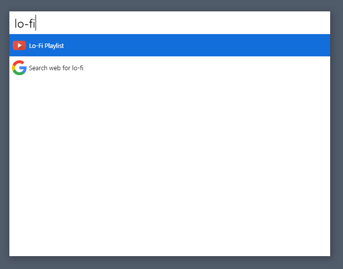

# cerebro-custom-command
> A simple plugin to create custom commands to Cerebro App only editing a JSON file

## Usage

* Create a file in %appdata%/cerebro-plugin-commandmaker/config.json
* In the file add your commands

Now when you search a term and it matches one of the commands name, it will show. You can also add a icon! When selected, it will execute the specified command on the cmd(on Windows). Not tested on any other systems.
Maybe to work on linux it will be necessary edit this code and change the folder from %appdata% to home or another system folder.

## Related

* [Cerebro](http://github.com/KELiON/cerebro) – main repo for Cerebro app;
* [Git.io](https://git.io/) – the reason this exists.
