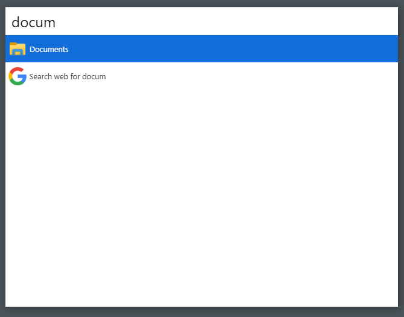
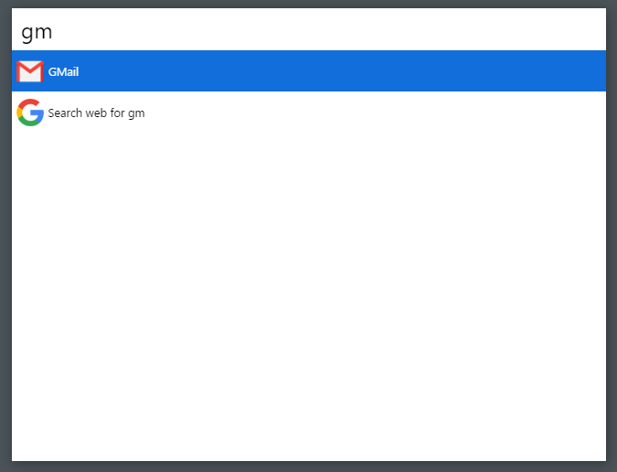

# cerebro-custom-command
A simple plugin to create custom commands to Cerebro only editing a JSON file

## Usage

* Create a file in %appdata%/cerebro-plugin-commandmaker/config.json
* In the file add your commands

```
{    
    "commands": [
        {
            "name": "Lo-Fi Playlist",
            "icon": "C:/path-to-icon/youtube-icon.png",
            "exec": "start chrome https://www.youtube.com/watch?v=Rhomn5Um9dg&list=RDRhomn5Um9dg&start_radio=1&t=0"
        }
    ]

}
```

Now when you search a term and it matches one of the commands name, it will show. You can also add a icon! When selected, it will execute the specified command on the cmd(on Windows). Not tested on any other systems.
Maybe to work on linux it will be necessary edit this code and change the folder from %appdata% to home or another system folder.


## Examples of commands to make

> This code examples are only for Windows, but can be changed to make the example work in any system

* Open a folder (favorite folder, project)
```
{
    "name": "Documents",
    "icon": "C:/path-to/folder_icon.png",
    "exec": "explorer /e, C:\\Users\\YourName\\Documents\\"
}
```


* Open the GMail
```
{
    "name": "GMail",
    "icon": "C:/path-to/gmail_icon.png",
    "exec": "start chrome https://mail.google.com/ "
}
```



## Possible troubleshooting

If you are on Windows and want a command that open the explorer in some folder using the ```explorer /e, C:\path```, you will have to use double bars to specify the path, for example: ```C:\\Users\\YourName\\Documents```.
Here is how it will be the full command in the config.json:
```
{
    "name": "Ahk Sripts Folder",
    "icon": "C:/path-to/icon.png",
    "exec": "explorer /e, C:\\Users\\YourName\\Documents\\AutoHotKey Scripts"
}
```


## Related

* [Cerebro](http://github.com/KELiON/cerebro) – main repo for Cerebro app;
